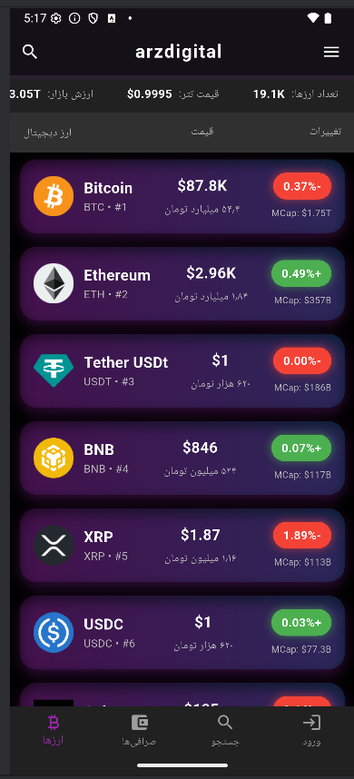
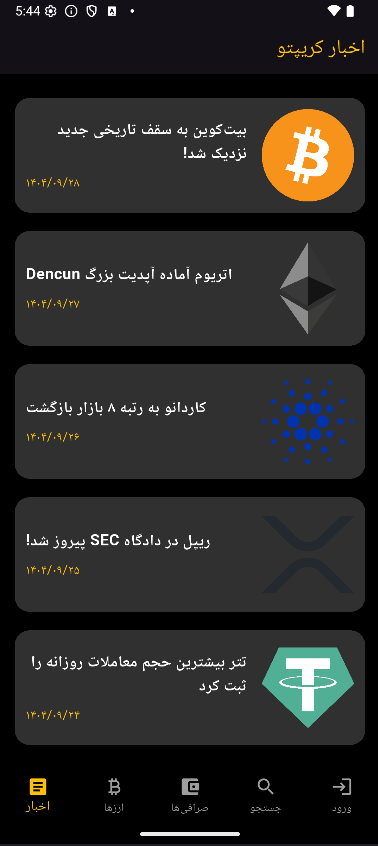
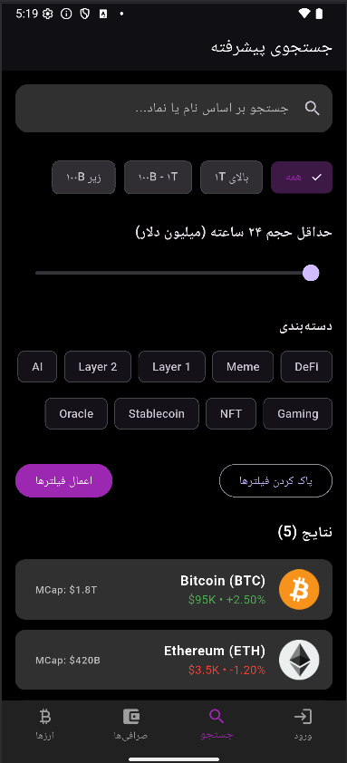
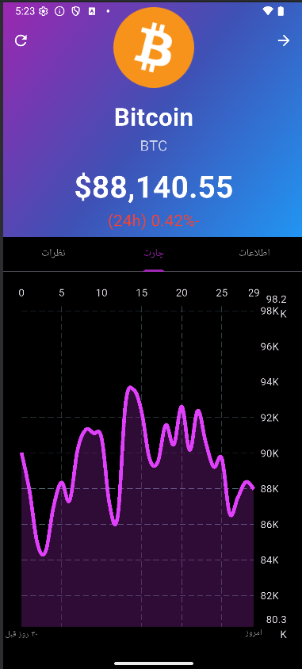
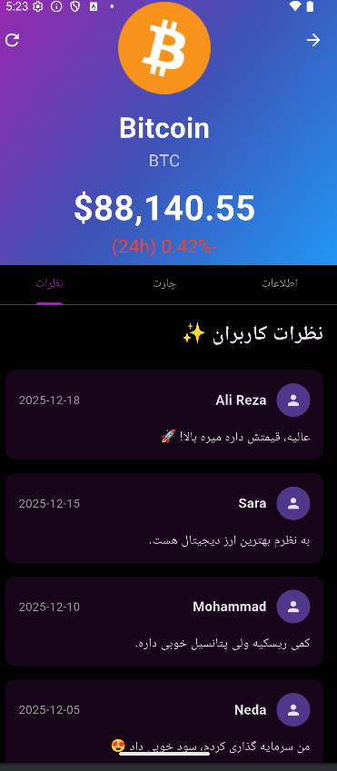
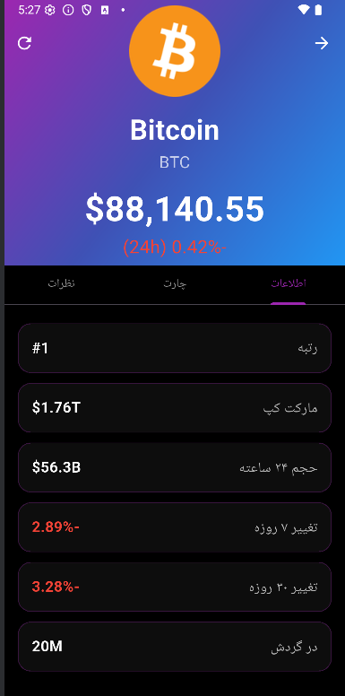
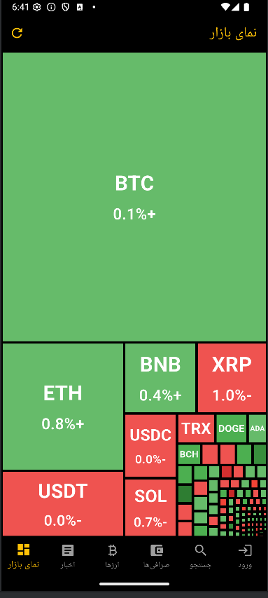

# ArzDigital - Cryptocurrency Market Tracker (Flutter App)


**ArzDigital** is a professional, fast, and fully Persian cryptocurrency tracking application built with Flutter. Featuring an elegant black-and-yellow theme, it delivers a clean, ad-free experience specifically tailored for Iranian traders and investors.

## Key Features

- Real-time prices for over 100 top cryptocurrencies (powered by CoinMarketCap & CoinGecko APIs)
- Prices displayed in both **USD** and **IRR (Toman)** with approximate conversion rate
- Interactive 30-day price charts using FlChart
- 24-hour price change indicator with animated heartbeat badge
- Global market stats: market cap, 24h volume, and Bitcoin dominance
- Advanced search functionality with filters:
  - Positive/Negative 24h change
  - Market cap tiers (high, mid, low)
  - Minimum 24h trading volume
- Dedicated **Exchanges** section introducing 8 major global platforms (Binance, Bybit, KuCoin, OKX, Coinbase, Kraken, Gate.io, Bitget) with detailed Persian descriptions and direct website links
- Beautiful **Login/Register** demo screens (no backend required)
- Full **RTL support** and complete Persian localization
- Modern black-and-yellow theme for a premium, energetic look and feel
- Offline caching, high performance, and completely ad-free

## Screenshots

<div align="center">
  <h4>🏠 Project Images</h4>

  <table>
    <tr>
        <td></td>
        <td></td>
          <td></td>
             <td></td>
    </tr>
    <tr>
         <td></td>
         <td></td>
          <td></td>
          <td></td>
    </tr>
    <tr>
         <td></td>
         <td></td>
          <td></td>
           <td></td>
    </tr>
  </table>
</div>


## Getting Started

```bash
# Clone the repository
git clone https://github.com/keivanV/Arzdigital.git

# Navigate to the project directory
cd arzdigital

# Install dependencies
flutter pub get

# Run the app
flutter run